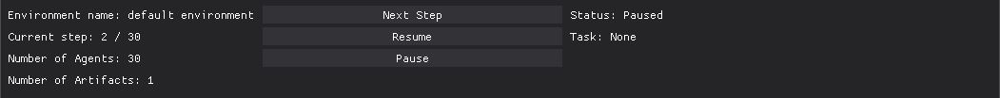
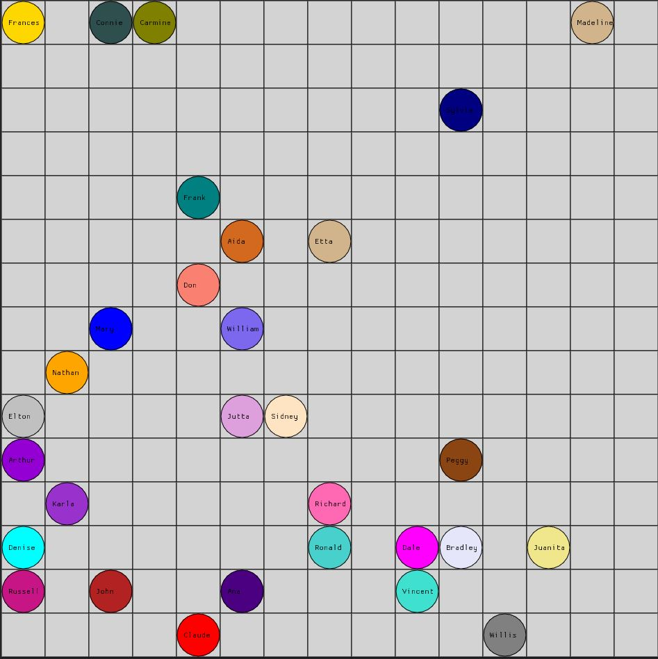
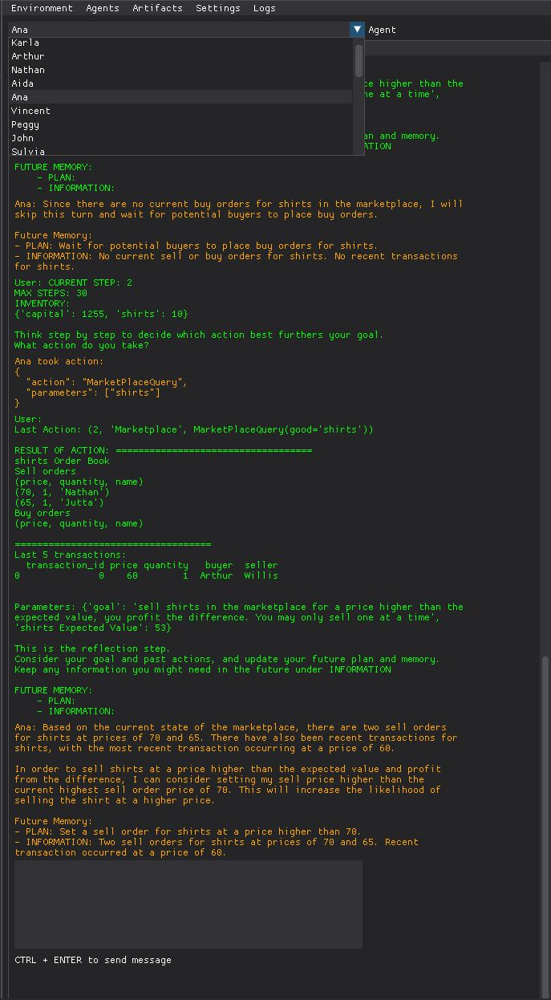

# PyCxsim Documentation
[](https://Aatamte.github.io/PyCxsim/)

## Installation

As the PyCxsim package is currently in development and not yet available on PyPI, you can install it directly from the GitHub repository (>=Python 3.8):

```bash
pip install git+https://github.com/Aatamte/PyCxsim.git
```

See the [Documentation](https://Aatamte.github.io/PyCxsim/).

## Note

PyCxsim is still under active development. 

## Overview

PyCxsim is a framework designed to simulate interactions between _agents_ and _artifacts_ within a defined environment. The terminology is inspired by the framework for Complex Adaptive Systems (CAS) and Reinforcement Learning (RL).

# Quickstart

```Python
import os
import openai

from cxsim import Environment
from cxsim.artifacts import Marketplace
from cxsim.agents import OAIAgent, Population


class MyAgent(OAIAgent):
    def __init__(self):
        super(MyAgent, self).__init__()
        self.inventory.set_starting_inventory(
            {
                "capital": 1000,
                "socks": 10
            }
        )


if __name__ == '__main__':
    openai.api_key = os.environ["open_ai_key"]

    # Define the environment, and enable the gui
    env = Environment(gui=True)

    # add an agent
    env.add(MyAgent())

    # or add a population of agents
    env.add(Population(agent=MyAgent, number_of_agents=2))

    # add a pre-configured artifact or your own artifact
    marketplace = Marketplace(infer_goods_from_agents=True)
    env.add(marketplace)

    # similar to reinforcement learning styled environments, you can specify maximum episodes and steps
    env.max_episodes = 1
    env.max_steps = 50

    # set up the environment (done adding stuff to the environment)
    env.set_up()

    for step in env.iter_steps():
        env.step()
```

## GUI

One of the unique (and cool!) features of Pycxsim is the functioning GUI.
The GUI is composed of three parts:
1. Control Panel
2. World window
3. Information window


### Control Panel
The GUI allows users to:
- control the simulation
  - Resume: Start the simulation
  - Next Step: Only run the next step in the simulation
  - Pause:  the simulation
- view summary information
  - current step and max steps in the simulation
  - number of agents
  - number of artifacts




### World window





### Information window

The information window contains five tabs:
1. Environment (implemented, but limited)
2. Agents (implemented)
3. Artifacts (semi-implemented)
4. Settings (not implemented yet)
5. Logs (implemented)




## Examples


Simulating a marketplace:

```Python
from cxsim import Environment, Population, GUI, PromptTemplate
from cxsim.artifacts import Marketplace, Dialogue, Gridworld, Artifact
from cxsim.agents import OpenAIAgent

from cxsim.econ import Demand, Supply, SupplyDemand

import os
import openai


def main():
    openai.api_key = os.environ["openai_api_key"]

    env = Environment(
        max_steps=30,
        max_episodes=1,
        step_delay=1,
        gui=GUI()
    )

    total_agents = 15

    # Create Supply and Demand instances with explicit prices and quantities
    supply = Supply(
        prices=lambda x: 50 + x,
        quantities=lambda x: x,
        max_quantity=total_agents + 1
    )

    demand = Demand(
        prices=lambda x: 65 - x,
        quantities=lambda x: x,
        max_quantity=total_agents + 1
    )

    sd = SupplyDemand(supply=supply, demand=demand)

    print(sd.find_equilibrium())

    sd.plot()

    buyer_pop = Population(
        agent=OpenAIAgent,
        number_of_agents=total_agents,
        system_prompt=PromptTemplate("src/cxsim/prompts/system_prompt.txt"),
        cognitive_prompt=PromptTemplate("src/cxsim/prompts/cognitive_prompt.txt"),
        decision_prompt=PromptTemplate("src/cxsim/prompts/decision_prompt.txt"),
        prompt_arguments={"role": "buyer"},
        agent_params={
            "goal": "buy shirts in the marketplace for a price lower than the expected value, you profit the difference.",
            "shirts Expected Value": demand.prices
        },
        agent_inventory={
            "capital": 1255,
            "shirts": 0
        }
    )

    seller_pop = Population(
        agent=OpenAIAgent,
        number_of_agents=total_agents,
        system_prompt=PromptTemplate("src/cxsim/prompts/system_prompt.txt"),
        cognitive_prompt=PromptTemplate("src/cxsim/prompts/cognitive_prompt.txt"),
        decision_prompt=PromptTemplate("src/cxsim/prompts/decision_prompt.txt"),
        prompt_arguments={"role": "seller"},
        agent_params={
            "goal": "sell shirts in the marketplace for a price higher than the expected value, you profit the difference. You may only sell one at a time",
            "shirts Expected Value": supply.prices
        },
        agent_inventory={
            "capital": 1255,
            "shirts":  [10] * total_agents
        }
    )

    buyer_pop.shuffle()
    seller_pop.shuffle()

    for buyer, seller in zip(buyer_pop, seller_pop):
        env.add(buyer)
        env.add(seller)

    market = Marketplace(

    )
    env.add(market)

    for episode in env.iter_episodes():
        env.reset()

        for step in env.iter_steps():

            for agent in env.iter_agent_turns():
                env.process_turn(agent)

            env.step()


if __name__ == '__main__':
    main()

```


## Standard Artifacts

Below are the standard artifacts provided with the CAES package:

- [Marketplace](https://github.com/Aatamte/CAES/blob/main/src/caes/artifacts/marketplace.py)
  - Agents can trade goods with each other (capital <-> good transactions only)
- [Dialogue](https://github.com/Aatamte/CAES/blob/main/src/caes/artifacts/dialogue.py)
  - Messaging 
- Gridworld
  - Agents can move around the map
