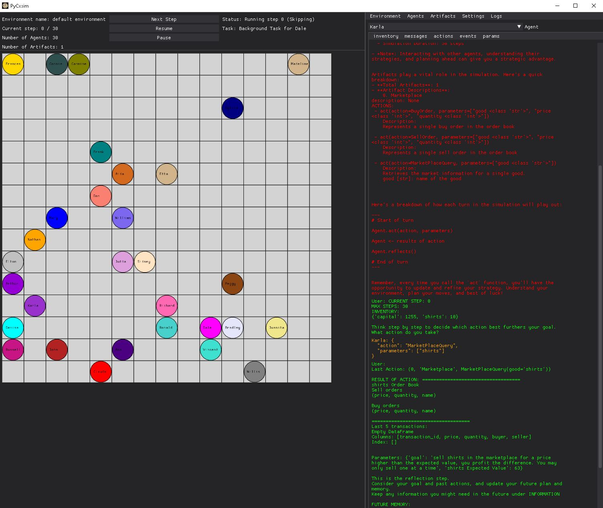

[](https://Aatamte.github.io/PyCxsim/)


Note: PyCxsim is still under active development.

[Documentation](https://Aatamte.github.io/PyCxsim/).

## Installation

You can install the latest version of PyCxsim directly from the GitHub repository (>=Python 3.8):

```bash
pip install git+https://github.com/Aatamte/PyCxsim.git
```

or directly from pip:

```bash
pip install pycxsim
```

## Overview

PyCxsim is a framework to simulate computational agents in a confined environment.

### Structure

```Python
from cxsim import Environment
from cxsim.artifacts import Marketplace
from cxsim.agents import Agent

# defining an environment
cxenv = Environment()

# adding an Artifact to the environment
market = Marketplace()
cxenv.add(market)

#adding an agent to the environment
agent = Agent()
cxenv.add(agent)

#the simulation loop
for episode in cxenv.iter_episodes():
    # start the next episode
    cxenv.reset()
    
    for step in cxenv.iter_steps():
        # start the next step
        cxenv.step()

```


### GUI

One of the unique (and cool!) features of Pycxsim is the embedded GUI.



## Examples

1. Simulate a marketplace made up of computational agents, based off experiments in the paper [“An Experimental Study of Competitive Market Behavior”](https://digitalcommons.chapman.edu/cgi/viewcontent.cgi?article=1027&context=economics_articles)  by Vernon Smith.
```Python
from cxsim.examples import Smith1962Environment
import openai
import os

openai.api_key = os.environ["openai_api_key"]

cxenv = Smith1962Environment(n_agents=10, model_id="gpt-4")
cxenv.test_one(market_depth=10)
```

## Standard Artifacts

Below are the standard artifacts provided with the CAES package:

- [Marketplace](https://github.com/Aatamte/CAES/blob/main/src/caes/artifacts/marketplace.py)
  - Agents can trade goods with each other (capital <-> good transactions only)
- [Dialogue](https://github.com/Aatamte/CAES/blob/main/src/caes/artifacts/dialogue.py)
  - Messaging 
- Gridworld
  - Agents can move around the map
